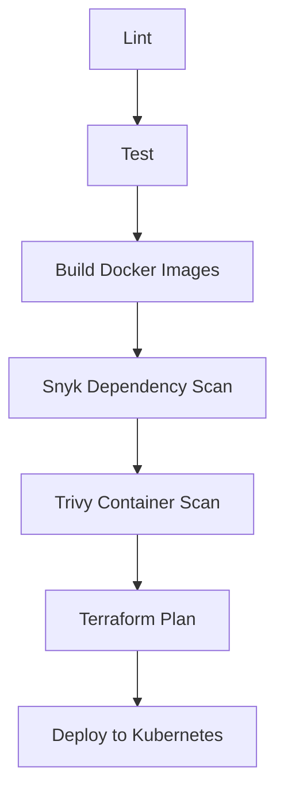

# ESG Platform

## Overview

This ESG platform is an **AI data center sustainability** reference implementation for monitoring and improving environmental performance of data centers running AI workloads. It provides:

- **Compliance Validation** — Environmental report validation and attestation
- **Smart Environmental Alerts** — Real-time telemetry and threshold-based alerts (CO₂, temperature)
- **Environmental What-If Simulator** — Carbon footprint projection under efficiency and energy-mix scenarios
- **Sustainability Telemetry & Metrics** — Carbon, water, efficiency, and hardware telemetry with compute-normalized metrics, data lineage, and a sustainability scorecard

Platform purpose: unified ingestion, calculation, and reporting for **AI data center sustainability** (carbon per GPU-hour, water usage effectiveness, PUE, embodied carbon, and related KPIs) with strict schema validation, emission factor versioning, and auditability.

---

## Architecture

- **Telemetry ingestion pipeline** — `POST /api/telemetry/ingest` accepts JSON payloads with energy, water, carbon, compute, hardware, and data-quality blocks. Payloads are schema-validated, normalized to canonical units (kWh, liters, GPU-hours), and stored with a unique constraint for idempotency (`source_id` + `external_event_id`). All timestamps are normalized to UTC.
- **Calculation engine** — Carbon (Scope 1/2, carbon per GPU-hour, per training run, per inference), water (WUE, water per GPU-hour, reclaimed %), efficiency (PUE, DCiE, cooling energy %, chiller COP), hardware (utilization %, idle %), and data-quality (completeness, latency, confidence, outlier/drift flags) are computed from raw telemetry using versioned emission factors.
- **Storage model** — Time-series–oriented SQLite store: `telemetry_raw`, `metrics_carbon`, `metrics_water`, `metrics_efficiency`, `metrics_hardware`, `metrics_data_quality`, and an optional asset registry. Emission factors are loaded from versioned JSON under `data/emission_factors/`.
- **Audit / logging layer** — Immutable append-only JSONL audit log (e.g. `logs/telemetry_audit.log`) for ingest accepted/rejected, calculations, alerts, and duplicate rejection. No in-place mutation.
- **Alerting system** — Alert engine evaluates carbon intensity spikes, water inefficiency (WUE, water per GPU-hour, reclaimed %), cooling anomalies (PUE, cooling %, chiller COP), and sensor drift. Thresholds are configurable via environment variables.

---

## Supported Metrics

### Carbon metrics

| Metric | Description | Unit |
|--------|-------------|------|
| Scope 1 emissions | From generator fuel (diesel, natural gas) | kg CO₂e |
| Scope 2 (location-based) | Grid emissions by location | kg CO₂e |
| Scope 2 (market-based) | Grid emissions by market | kg CO₂e |
| Time-of-use grid carbon intensity | Carbon intensity of grid by interval | kg CO₂e/kWh |
| Carbon per GPU-hour | Total carbon / GPU-hours | kg CO₂e/GPU-hour |
| Carbon per training run | Total carbon / training runs | kg CO₂e/run |
| Carbon per inference request | Total carbon / inference requests | kg CO₂e/request |
| Embodied carbon per asset | Amortized embodied carbon per GPU-hour | kg CO₂e/GPU-hour |

### Water metrics

| Metric | Description | Unit |
|--------|-------------|------|
| Total water withdrawal | Total water drawn | liters |
| Water consumed vs returned | Consumed and returned volumes | liters |
| Reclaimed water % | Reclaimed as % of withdrawal | % |
| WUE (Water Usage Effectiveness) | Cooling water / IT energy | L/kWh |
| Water per GPU-hour | Total water / GPU-hours | L/GPU-hour |
| Water per training run | Total water / training runs | L/run |
| Cooling tower (evaporation, blowdown) | Tower telemetry | liters |
| Regional water stress weighting | Multiplier by region | — |

### Efficiency metrics

| Metric | Description | Unit |
|--------|-------------|------|
| PUE | Total facility energy / IT energy | ratio |
| DCiE | 1 / PUE | ratio |
| Energy per compute workload | kWh per GPU-hour, per run, per request | kWh/unit |
| Cooling energy % | Cooling energy / total facility energy | % |
| Chiller COP | Cooling effect / chiller energy | ratio |

### Hardware metrics

| Metric | Description | Unit |
|--------|-------------|------|
| Asset registry (embodied carbon) | Per-asset embodied carbon and lifetime | kg CO₂e, hours |
| Lifecycle emission modeling | Amortized embodied carbon per GPU-hour | kg CO₂e/GPU-hour |
| Hardware utilization % | Utilization rate | % |
| Idle rate % | Idle time rate | % |

### Data quality metrics

| Metric | Description | Unit |
|--------|-------------|------|
| Data completeness % | Expected vs actual samples | % |
| Data latency | Ingestion time − observation time | seconds |
| Outlier detection flag | Statistical outlier (e.g. z-score) | flag |
| Sensor drift detection | Baseline vs recent shift | flag |
| Confidence score per metric | Composite of completeness, latency, outlier, drift | 0–1 |

### Formulas

- **PUE** = Total facility energy (kWh) / IT equipment energy (kWh)
- **WUE** = Total water used for cooling (L) / IT energy (kWh)
- **Carbon per GPU-hour** = Total kg CO₂e / GPU-hours
- **Carbon per training run** = Total kg CO₂e / number of training runs
- **Sustainability Score** = (w_carbon × (1 − C_norm)) + (w_water × (1 − W_norm)) + (w_efficiency × (1 − PUE_norm)) + (w_hardware × U_norm), with configurable weights and documented baselines (carbon/water intensity, PUE range, utilization target). Score 0–1 or 0–100.

---

## Data Governance

- **Emission factor versioning** — All carbon calculations use a versioned emission factor store (`data/emission_factors/*.json`). Each factor set has `version_id`, `valid_from`, `valid_to`, and per-region overrides. Stored metrics reference `emission_factor_version` for reproducibility.
- **Audit trail** — Every ingest (accepted/rejected), calculation, alert, and duplicate rejection is written to an immutable JSONL audit log.
- **Data lineage** — Each derived metric stores lineage: `raw_payload_id`, `source_id`, `ingestion_request_id`, `emission_factor_version`, and calculation step. Lineage can be queried for traceability.
- **Compliance alignment** — Methodology aligns with GHG Protocol (Scope 1/2), ISO 14064, and common carbon accounting practice for data centers.

---

## Data sources

The platform supports ESG data from multiple origins:

| Category | Examples | Current / planned |
|----------|----------|-------------------|
| **IoT sensor data** | Energy meters, water meters, emissions sensors | Alerts: CO₂ ppm, temperature. Telemetry: full carbon, water, energy, compute, hardware. |
| **API feeds** | Utility providers, fleet systems, ERP, carbon accounting tools | Normalize to telemetry ingest schema; use `X-Ingestion-Source`. |
| **Manual entries** | Facility logs, supplier disclosures | Compliance flow; structured manual data via telemetry schema possible. |
| **Derived metrics** | Scope 1/2/3, intensity ratios | Telemetry calculation engine; simulator for footprint projection. |
| **Event-driven alerts** | Threshold breaches, anomalies | Alerts service (CO₂/temp); telemetry alert engine (carbon, water, PUE, drift). |

### Ingestion protocol

- **Spec:** [docs/INGESTION_PROTOCOL.md](docs/INGESTION_PROTOCOL.md)
- **Transport:** `POST` with `Content-Type: application/json` to the appropriate `/api/<service>/` path.
- **Auth:** Compliance requires `X-API-KEY`; telemetry and simulator do not.
- **Responses:** JSON; errors use `{"error": {"code": "...", "message": "..."}}` with HTTP 400, 403, 415, 409, 500 as applicable.
- **Optional headers:** `X-Request-ID`, `X-Ingestion-Source`, `X-Source-ID`.

| Ingestion type | Endpoint | Purpose |
|----------------|----------|---------|
| Telemetry (legacy CO₂/temp) | `POST /api/alerts/process-telemetry` | CO₂ ppm, temperature |
| **Sustainability telemetry** | **`POST /api/telemetry/ingest`** | **Carbon, water, energy, compute, hardware, data quality** |
| Compliance (reports) | `POST /api/compliance/validate` | Report validation (API key) |
| Simulation input | `POST /api/simulator/simulate` | Current footprint + scenario params |

---

## Module Overview

1. **Compliance Validation** — Environmental report validation.
2. **Smart Environmental Alerts** — Real-time CO₂ and temperature alerts.
3. **Environmental What-If Simulator** — Carbon projection scenarios.
4. **Sustainability Telemetry** — Ingestion, calculations, lineage, audit, alerts, scorecard.
5. **Frontend** — UI for dashboard, compliance, simulator (and optional telemetry).

---

## Testing

- **Test categories** — Unit tests (schema, units, carbon/water/efficiency/scorecard/alert logic), duplicate and missing-telemetry handling, emission factor regression, lineage checks, and (when Flask is installed) integration tests for ingest, duplicate rejection, and report endpoint.
- **Regression validation** — Carbon calculations are tested against a benchmark dataset with ±0.5% variance requirement; emission factor version is pinned. Data lineage and version reference are asserted.
- **Load testing** — Telemetry ingestion is idempotent and can be load-tested with concurrent `POST /ingest`; duplicate key constraint prevents double-counting.

**Run telemetry tests:**

```bash
# From repo root; install telemetry deps for full suite (including integration)
pip install -r services/telemetry/requirements.txt
python -m pytest tests/telemetry -v
```

Without Flask, integration tests are skipped; all other telemetry tests run.

---

## Deployment

- **Required services** — Compliance (8080), Alerts (8081), Simulator (8082), Telemetry (8083), Frontend (3000). See `docker-compose.yml`.
- **Environment variables** — Compliance: `ADMIN_KEY`, `AUDITOR_KEY`. Telemetry: `TELEMETRY_DATA_DIR` (optional, for DB and emission factors), `PORT` (default 8083), alert thresholds (`TELEMETRY_ALERT_*`), scorecard weights (`TELEMETRY_SCORECARD_WEIGHT_*`).
- **Secrets management** — Kubernetes Secrets and `.env`; never commit keys.
- **Scaling** — Telemetry ingestion is stateless per request; storage is file-based (SQLite). For horizontal scaling, use a shared DB or replace with a distributed store; idempotency keys (`source_id`, `external_event_id`) remain required.

---

## Frontend Details

The frontend integrates with backends at `/api/alerts/`, `/api/compliance/`, `/api/simulator/`. Optional: proxy `/api/telemetry/` to the telemetry service (port 8083) for sustainability ingest and report.

### Running the full stack (frontend + backends)

1. **Docker Compose:** If you don't have a `.env` file, copy `.env.example` to `.env` (set `ADMIN_KEY` and `AUDITOR_KEY` for production). Run `docker compose up --build`. Open http://localhost:3000.
2. **Local:** Start compliance (8080), alerts (8081), simulator (8082), telemetry (8083), then frontend `npm run dev`. Open http://localhost:9000.

---

## CI/CD Pipeline



Include telemetry tests in CI: `pytest tests/telemetry` (install `services/telemetry/requirements.txt` first). CI should fail if emissions variance exceeds ±0.5% vs benchmark, data lineage lacks version, or duplicate payload is accepted.

---

## Kubernetes, Terraform, Security, Logging

- **Kubernetes:** Apply ConfigMaps/Secrets; deploy manifests (add telemetry deployment and service for 8083).
- **Terraform:** `terraform init && terraform plan && terraform apply`.
- **Security:** RBAC (admin, auditor, viewer); validate required env keys.
- **Secrets:** Kubernetes Secrets and `.env`.
- **Logging:** Structured JSON logs; optional Splunk/ELK.

---

## Example dataset and report

- **Benchmark telemetry:** `data/examples/benchmark_telemetry.json` — sample payload for validation (expected PUE, WUE, carbon per GPU-hour, etc.).
- **Sample report:** `examples/sample_report.json` — example output shape for carbon, water, efficiency, hardware, data quality, sustainability score, and lineage.

---

## Example Commands

- Launch stack: `docker-compose up`
- Run telemetry tests: `pip install -r services/telemetry/requirements.txt && python -m pytest tests/telemetry -v`
- Simulate Terraform: `bash simulate_terraform.sh`
