# Universal ESG Reporting & Telemetry Infrastructure

<div align="center">

**Sustainability-as-Code Framework** — Mission-critical environmental telemetry for the modern enterprise.

[](https://www.docker.com/)
[](https://www.python.org/)
[](https://flask.palletsprojects.com/)
[](https://reactjs.org/)
[](https://pytest.org/)

</div>

---

## 📋 High-Level Overview

This is not just an application. It is a **Sustainability-as-Code framework** that treats carbon and water data with the same mission-critical rigor as system logs.

**Universal Ingestion** is our core architectural principle: a unified pipeline capable of ingesting environmental telemetry from any source, transforming it into standardized metrics, and delivering auditable reports for regulatory compliance. The platform provides seamless integration across four distinct verticals:

- **AI Data Centers**: GPU-intensive workloads, PUE optimization, water consumption tracking
- **Logistics & Fleet**: Vehicle emissions, route optimization, carbon-per-mile analytics
- **Smart Manufacturing**: Production-line energy, industrial IoT sensors, process efficiency
- **Cloud SaaS**: API request carbon attribution, multi-tenant cost/impact allocation

By unifying these verticals under a single schema, organizations eliminate data silos and gain cross-functional visibility into their environmental footprint.

---

## 🏗️ Architecture

### Modular Service-Oriented Design

The platform is architected as a constellation of purpose-built microservices, each optimized for a specific domain:

```mermaid
flowchart TB
    subgraph Ingestion["🌍 Telemetry Ingestion Service (Port 8083)"]
        A1[Sensor Data API]
        A2[CSV/JSONL Bulk Upload]
        A3[External ETL Hooks]
    end

    subgraph Processing["📊 Processing Layer"]
        B1[Idempotent Validation]
        B2[Unit Normalization]
        B3[Versioned Emission Factors]
    end

    subgraph Compliance["⚖️ Compliance Service (Port 8080)"]
        C1[GHG Protocol Calculations]
        C2[Regulatory Report Generation]
        C3[Audit Log Emission]
    end

    subgraph Simulator["🔮 Simulator Service (Port 8082)"]
        D1[Monte Carlo Projections]
        D2[What-If Scenario Modeling]
        D3[Efficiency Trend Forecasting]
    end

    subgraph Alerts["🚨 Alerts Service (Port 8081)"]
        E1[Threshold Monitoring]
        E2[Anomaly Detection]
        E3[Webhook Notifications]
    end

    subgraph Storage["💾 Data Layer"]
        F1[(SQLite / External DB)]
        F2[Immutable JSONL Audit Logs]
        F3[Versioned Emission Factor Registry]
    end

    subgraph Frontend["🖥️ Next.js Frontend (Port 3000)"]
        G1[Dashboard]
        G2[Scorecards]
        G3[Lineage Explorer]
    end

    Ingestion --> Processing --> Compliance
    Processing --> Simulator
    Processing --> Alerts
    Compliance --> Storage
    Simulator --> Storage
    Alerts --> Storage
    Compliance --> Frontend
    Simulator --> Frontend
    Alerts --> Frontend
```



### Service Responsibilities

| Service | Port | Core Function |
|---------|------|---------------|
| **Telemetry** | `8083` | Ingestion API, data validation, unit conversion, source tagging |
| **Compliance** | `8080` | GHG Protocol math, emission factor resolution, regulatory formatting |
| **Simulator** | `8082` | Predictive modeling, scenario analysis, projection endpoints |
| **Alerts** | `8081` | Rule-based monitoring, threshold breaches, anomaly notifications |
| **Frontend** | `3000` | React/Next.js dashboard, visualization, export tooling |

---

## 📊 Cross-Vertical Metric Adaptation

The platform automatically adapts measurement units, emission factors, and reporting formats based on the source vertical:

| **Vertical** | **Primary Functional Unit** | **Core KPI** | **Key Metrics Tracked** |
|:-------------|:----------------------------|:-------------|:------------------------|
| **AI Data Center** | GPU-Hour | **PUE** (Power Usage Effectiveness) | Energy (kWh), Water (L), GPU Utilization%, Carbon per GPU-hr |
| **Logistics / Fleet** | Vehicle Mile | **Carbon-per-Mile** (gCO₂/mi) | Fuel (L), Distance (km/mi), Vehicle Class, Route Efficiency |
| **Smart Manufacturing** | Production Unit | **Carbon-per-Unit** (kgCO₂/unit) | Electricity (MWh), Process Heat, Raw Material Mass, Waste % |
| **Cloud SaaS** | API Request | **Carbon-per-Request** (mgCO₂/req) | Compute Time (ms), Data Transfer (GB), Region Carbon Intensity |

---

## 🔒 DevOps & Governance Features

### Idempotent Ingestion
All telemetry submissions are deduplicated via composite key validation:
```
(source_id, external_event_id) → Unique Constraint
```
This guarantees exactly-once semantics for sensor streams and batch ETL jobs.

### Versioned Emission Factors
Carbon calculations use **reproducible, version-locked emission factors** stored in JSON registries. Each factor includes:
- Semantic version (e.g., `2024.3.1`)
- Geographical applicability (grid region, country code)
- Source authority (EPA, DEFRA, IEA, custom)
- Uncertainty bounds for Monte Carlo simulation

### Auditability: Immutable JSONL Logs
GHG Protocol compliance requires tamper-evident audit trails. All raw telemetry and computed emissions are appended to **immutable JSONL files** with SHA-256 content hashes, suitable for external auditor review.

### Data Lineage
Full traceability from raw sensor → normalized record → emission calculation → report cell. The lineage graph captures:
- Source system identifiers
- Transformation operations (unit conversion, interpolation)
- Emission factor versions applied
- Calculation timestamps and responsible service

---

## 📐 Sustainability Score Formula

The composite **Sustainability Score** $S$ aggregates efficiency metrics across all verticals:

$$
S = \underbrace{w_{1} \cdot \frac{1}{\text{PUE}_{\text{norm}} - 1}}_{\text{Data Center Efficiency}} + \underbrace{w_{2} \cdot \frac{1}{\text{Carbon}_{\text{mile}}}}_{\text{Logistics Efficiency}} + \underbrace{w_{3} \cdot \frac{\text{Production}}{\text{Energy} \cdot \text{Factor}_{\text{grid}}}}_{\text{Manufacturing Yield}} + \underbrace{w_{4} \cdot \frac{\text{Requests}}{\text{Carbon}_{\text{req}} \cdot 10^{6}}}_{\text{SaaS Density}}
$$

Where weights $w_{1..4}$ are normalized to $\sum w_{i} = 1$ based on organizational prioritization.

---

## 🛠️ Tech Stack

| Layer | Technology | Purpose |
|:------|:-----------|:--------|
| **Frontend** | React 18 + Next.js | Dashboard, data visualization, export UI |
| **Backend** | Python 3.11 + Flask | REST API, calculations, ingestion |
| **Storage** | SQLite (default) / PostgreSQL | Relational data, JSONL audit logs |
| **DevOps** | Docker + Docker Compose | Local development, service orchestration |
| **Orchestration** | Kubernetes (optional) | Production deployment manifests included |
| **Testing** | Pytest (backend) + Jest (frontend) | Unit, integration, E2E coverage |
| **CI/CD** | GitHub Actions | Automated testing, linting, image builds |

---

## 🚀 Quick Start

### Prerequisites
- Docker 20.10+ and Docker Compose 2.x
- Python 3.11+ (for local development)
- Node.js 18+ (for frontend development)

### 1. Clone and Configure
```bash
git clone <repository-url>
cd esg-software
cp .env.example .env
# Edit .env to set your environment variables
```

### 2. Start All Services
```bash
docker-compose up --build
```

Services will be available at:
- Frontend Dashboard: http://localhost:3000
- Telemetry API: http://localhost:8083
- Compliance API: http://localhost:8080
- Simulator API: http://localhost:8082
- Alerts API: http://localhost:8081

### 3. Verify Health
```bash
curl http://localhost:8080/health
curl http://localhost:8081/health
curl http://localhost:8082/health
curl http://localhost:8083/health
```

### 4. Run Tests
```bash
# Backend tests (inside telemetry container)
docker-compose exec telemetry pytest

# Frontend tests
npm test

# E2E tests
npm run test:e2e
```

---

## 📁 Project Structure

```
esg-software/
├── docker-compose.yml          # Service orchestration
├── docker-compose.sh           # Convenience startup script
├── .env.example                # Environment template
├── services/
│   ├── telemetry/              # Ingestion & validation (Port 8083)
│   │   ├── src/
│   │   │   ├── app.py          # Flask application
│   │   │   ├── calculations/   # Carbon, water, efficiency, hardware
│   │   │   ├── emission_factors.py
│   │   │   ├── audit.py        # JSONL audit logging
│   │   │   └── lineage.py      # Data provenance tracking
│   │   └── Dockerfile
│   ├── compliance/             # GHG calculations (Port 8080)
│   ├── simulator/              # Projections (Port 8082)
│   ├── alerts/                 # Monitoring (Port 8081)
│   └── frontend/               # Next.js dashboard (Port 3000)
├── tests/                      # Test suites
├── kubernetes/                 # K8s deployment manifests
├── terraform/                  # Infrastructure-as-code
└── docs/                       # Additional documentation
```

---

## 📜 API Documentation

### Telemetry Ingestion Endpoint
```http
POST /api/v1/telemetry
Content-Type: application/json

{
  "source_id": "datacenter-sfo-01",
  "external_event_id": "gpu-batch-2024-001",
  "vertical": "ai_data_center",
  "timestamp": "2024-03-15T14:30:00Z",
  "metrics": {
    "energy_kwh": 1250.5,
    "gpu_hours": 480,
    "water_liters": 3200,
    "pue": 1.15
  },
  "tags": {"region": "us-west-1", "facility": "SFO-DC01"}
}
```

### Compliance Report Generation
```http
POST /api/v1/reports/ghg
Content-Type: application/json

{
  "scope": [1, 2, 3],
  "date_range": {"start": "2024-01-01", "end": "2024-12-31"},
  "format": "json"
}
```

---

## 🤝 Contributing

1. Fork the repository
2. Create a feature branch (`git checkout -b feature/your-feature`)
3. Run tests (`pytest` and `npm test`)
4. Submit a Pull Request

Please ensure:
- All Python code passes `flake8` and `black` formatting
- All JavaScript passes ESLint
- New features include corresponding tests

---

## 📄 License

MIT License — see [LICENSE](./LICENSE) for details.

---

<div align="center">

**Built for enterprises serious about sustainability.**

[Documentation](docs/) • [API Reference](docs/api.md) • [Changelog](CHANGELOG.md)

</div>
